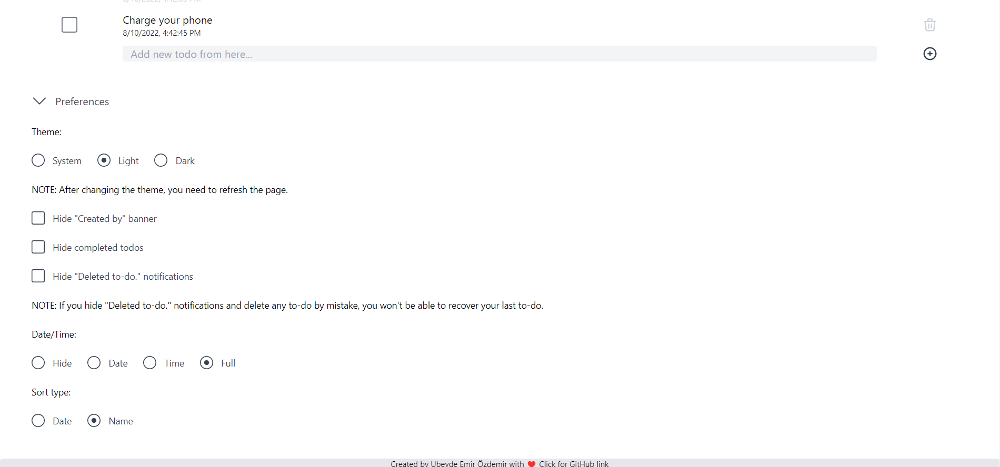
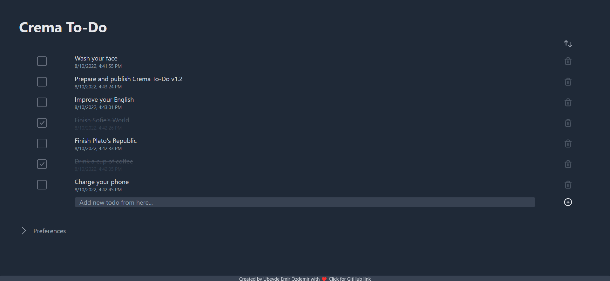
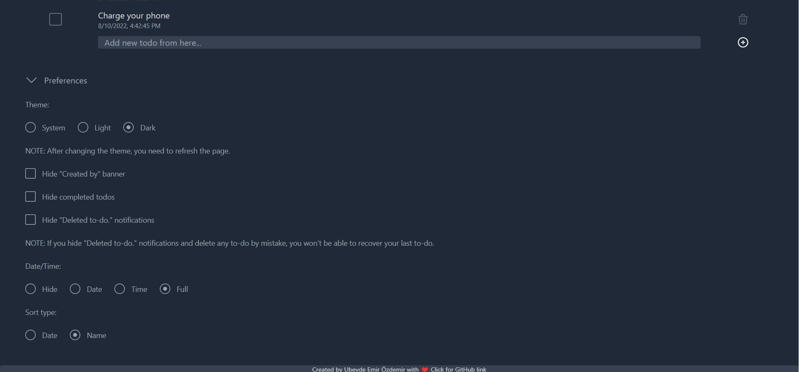

# Crema To-Do

A simple to-do app built using [Vue.js](https://vuejs.org) and [tailwindcss](https://tailwindcss.com).

In this to-do app, you can add new todos, edit them or delete them.

## What's new in v1.2?

- Preferences feature improved

  - "Hide To-Do deleted messages" option added for new recover last deleted to-do feature.
  - Now, you can see date or time (or both) below of your todos.
  - Now, you can sort your todos by name instead of date.

- Recover your last deleted to-do
  - If you deleted any to-do by mistake, you can recover it. Just press the "UNDO" button on the light red pop-up.

[See full changelog](./changelog.md)

## Development

`npm install` - Install required npm packages for development.

`npm run dev` - Required command for development.

`npm run build` - Take a build for production step.

`npm run preview` - Required to see the last status of your project.

## Screenshots

