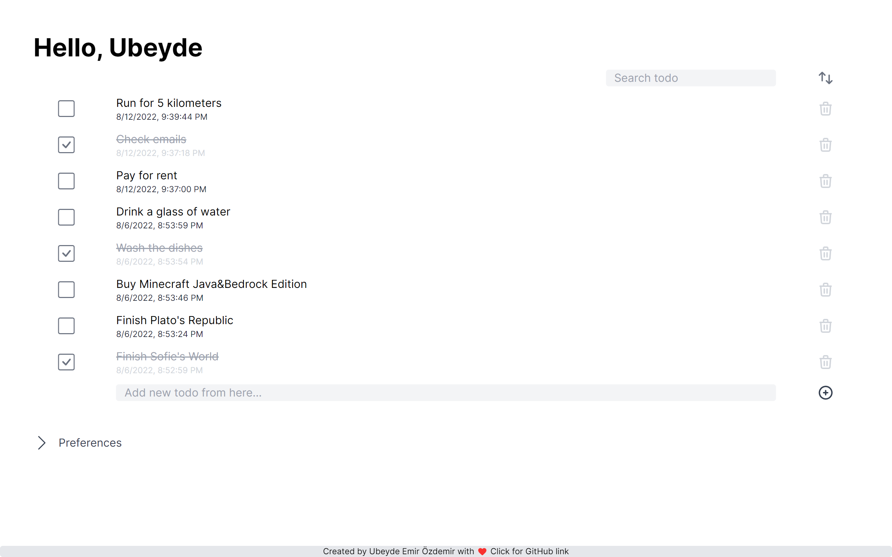
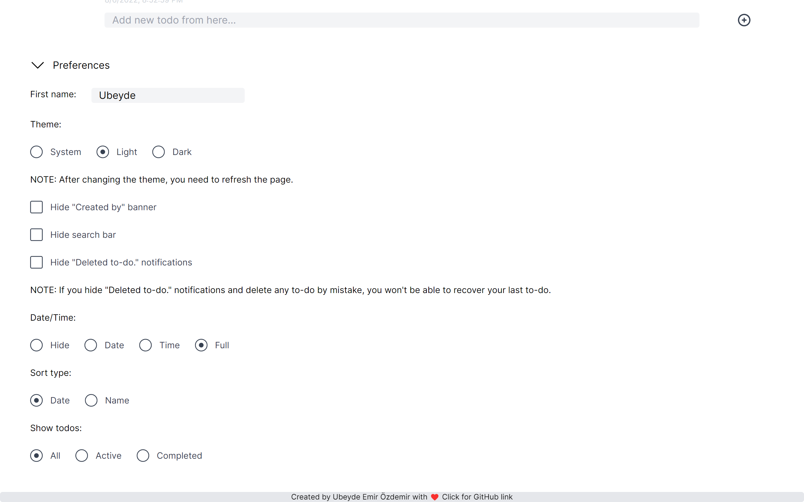
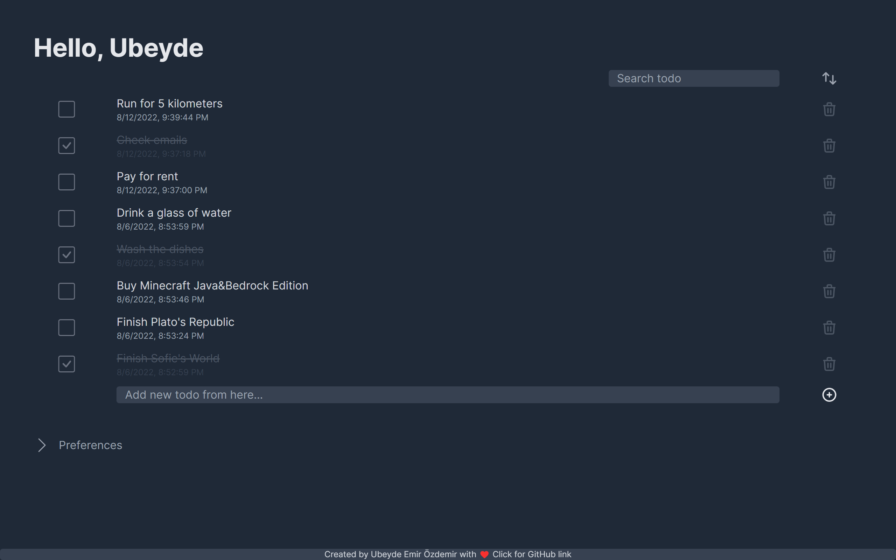
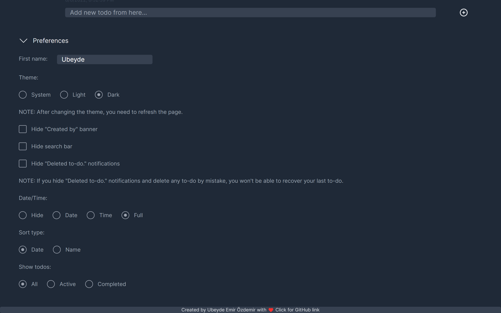

# Crema To-Do

A simple to-do app built using [Vue.js](https://vuejs.org) and [tailwindcss](https://tailwindcss.com).

In this to-do app, you can add new todos, edit them or delete them.

## What's new in v1.3?

- Now, you can input your first name to show up top of the page (Instead of Crema To-Do title).

  - To activate this feature, go to Preferences > First name.

- Search todo feature added (Now, you can input keywords to find todo which you want)

  - If you don't want a search bar top of todolist, you can hide search bar from preferences ("Hide search bar" feature added)

- Show completed todos feature added

  - Hide completed todos feature (boolean) removed; instead, added three option called "Show all todos", "Show active todos" and "Show completed todos".

[See full changelog](./changelog.md)

## Development

`npm install` - Install required npm packages for development.

`npm run dev` - Required command for development.

`npm run build` - Take a build for production step.

`npm run preview` - Required to see the last status of your project.

## Screenshots

